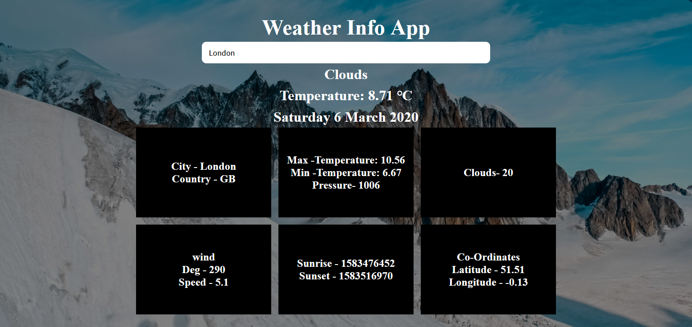

# **Weather Status Application with React**

## **Live Project:**  
https://kirankumargonti.github.io/Weather-Status-App-with-React/

Find your API Key at https://home.openweathermap.org/api_keys and make sure to put that in app.jsx file.

    Quick Start

    # Install dependencies
    npm install

    # Serve on localhost:3000
    npm start

    # Build for production
    npm run build

## **DemoPictures**

